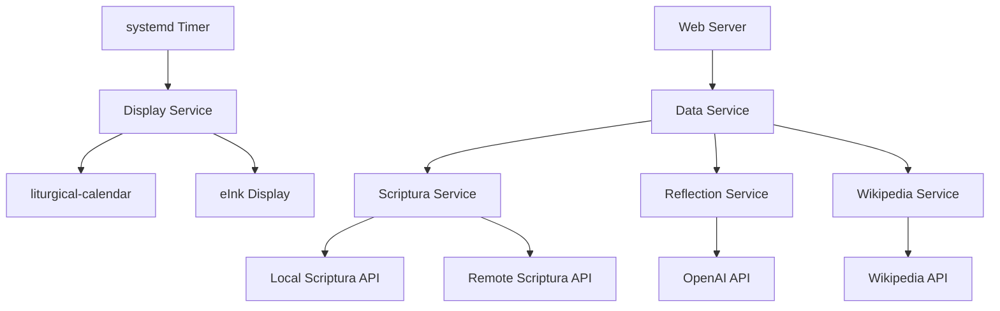

# 🏗️ Liturgical Display Architecture

## System Overview

The Liturgical Display system is a multi-service architecture running on a Raspberry Pi that displays daily liturgical information on an eInk display and provides web access to liturgical data.

## Core Components

### 1. Display Service (`liturgical.service`)
- **Purpose**: Updates the eInk display with daily liturgical images
- **Trigger**: Daily at 12:01 AM via systemd timer
- **Process**: 
  1. Pulls latest liturgical-calendar updates
  2. Caches artwork if needed
  3. Generates today's liturgical image
  4. Displays image on eInk screen
  5. Optionally shuts down Pi

### 2. Web Server Service (`liturgical-web.service`)
- **Purpose**: Provides web interface and API endpoints
- **Runtime**: Continuous (24/7)
- **Features**:
  - Web interface for viewing liturgical data
  - REST API for programmatic access
  - Reading content with clickable links
  - AI-generated daily reflections
  - Artwork and image serving

### 3. Scriptura API Service (`scriptura-api.service`)
- **Purpose**: Local Bible text API (optional)
- **Runtime**: Continuous (24/7)
- **Benefits**:
  - No rate limiting
  - Faster response times
  - Customizable parsing logic
  - Offline operation

## Service Dependencies



## Data Flow

### Daily Display Update
1. **Timer triggers** → Display Service starts
2. **Git pull** → Update liturgical-calendar package
3. **Cache artwork** → Download missing images
4. **Generate image** → Create today's liturgical display
5. **Display image** → Send to eInk screen via epdraw
6. **Optional shutdown** → Power off Pi

### Web Request Flow
1. **User request** → Web Server receives HTTP request
2. **Data Service** → Orchestrates data gathering
3. **Scriptura Service** → Fetches Bible reading content
4. **Reflection Service** → Generates AI reflection (if needed)
5. **Wikipedia Service** → Enriches feast/saint data
6. **Response** → Returns formatted data to user

## Configuration Management

### Primary Config (`config.yml`)
```yaml
# Display settings
output_image: /path/to/today.png
vcom: -2.51
shutdown_after_display: false

# Scriptura API settings
scriptura:
  use_local: true
  local_port: 8081
  version: "asv"

# OpenAI settings
openai:
  api_key: "your-key"
  model: "gpt-4o-mini"
  max_tokens: 300
```

### Service Configs
- **Web Server**: `web_server_config.yaml`
- **Scriptura API**: `.env` file in scriptura-api directory
- **Systemd**: Service files in `systemd/` directory

## API Architecture

### REST Endpoints

#### Data Endpoints
- `GET /api/today` - Today's liturgical data
- `GET /api/info/YYYY-MM-DD` - Specific date data
- `GET /api/reflection/today` - Today's reflection
- `GET /api/reflection/YYYY-MM-DD` - Date-specific reflection

#### Content Endpoints
- `GET /api/reading/REFERENCE` - Bible reading content
- `GET /api/artwork/today` - Today's artwork
- `GET /api/image/today/png` - Generated image

#### Utility Endpoints
- `GET /api/tokens` - OpenAI token usage
- `GET /api/health` - Service health check

### Response Format
```json
{
  "date": "2025-01-15",
  "season": "Ordinary Time",
  "title": "St. Paul the Hermit",
  "readings": [
    {
      "reference": "Jeremiah 18:1-11",
      "text": "The word that came to Jeremiah...",
      "formatted_text": "<p><span class=\"verse\"><span class=\"verse-number\">1</span> The word that came to Jeremiah...</span></p>"
    }
  ],
  "reflection": "Today we honor St. Paul the Hermit...",
  "prayer": "Lord, help us to find solitude...",
  "wikipedia_summary": "St. Paul the Hermit was...",
  "wikipedia_url": "https://en.wikipedia.org/wiki/Paul_of_Thebes"
}
```

## Caching Strategy

### File-based Caching
- **Reflections**: `cache/reflections/YYYY-MM-DD.json`
- **Wikipedia**: `cache/wikipedia/YYYY-MM-DD.json`
- **Artwork**: `cache/instagram_*.jpg`
- **Images**: `cache/images/YYYY-MM-DD.png`

### Cache Invalidation
- **Reflections**: Daily (one per date)
- **Wikipedia**: Daily (one per date)
- **Artwork**: Manual refresh via liturgical-calendar
- **Images**: Regenerated on demand

## Error Handling

### Graceful Degradation
- **Scriptura API failure**: Show reading references only
- **OpenAI API failure**: Show simple reflection
- **Wikipedia API failure**: Show feast name only
- **Network issues**: Use cached data when available

### Logging
- **Display Service**: Systemd journal + log file
- **Web Server**: Systemd journal + Flask logs
- **Scriptura API**: Systemd journal + FastAPI logs

## Security Considerations

### Service Isolation
- **User permissions**: Services run as non-root user
- **File permissions**: Restricted access to cache directories
- **Network**: Local services only (no external exposure)

### API Security
- **Rate limiting**: Built into Scriptura API
- **Input validation**: Sanitized reading references
- **Error handling**: No sensitive data in error messages

## Performance Optimization

### Local Services
- **Scriptura API**: Eliminates rate limiting
- **Caching**: Reduces API calls
- **Async processing**: Non-blocking web requests

### Resource Management
- **Memory**: Efficient image processing
- **Storage**: Automatic cache cleanup
- **CPU**: Optimized image rendering

## Monitoring & Maintenance

### Health Checks
- **Service status**: `systemctl status`
- **API health**: `/api/health` endpoint
- **Log monitoring**: `journalctl -f`

### Maintenance Tasks
- **Cache cleanup**: Automatic via liturgical-calendar
- **Log rotation**: Systemd journal management
- **Updates**: Git pull + package updates

## Future Enhancements

### Phase 3: Enhanced Scriptura API
- **Custom parsing**: Move complex logic to Scriptura fork
- **Advanced features**: Cross-chapter references, complex ranges
- **Performance**: Optimized parsing algorithms

### Phase 4: Simplified Integration
- **Cleaner code**: Remove parsing logic from liturgical_display
- **Better APIs**: Enhanced Scriptura endpoints
- **Documentation**: Complete API documentation

## Troubleshooting

### Common Issues
1. **Service not starting**: Check systemd logs
2. **API errors**: Verify configuration
3. **Display issues**: Check hardware connections
4. **Performance**: Monitor resource usage

### Debug Commands
```bash
# Check service status
sudo systemctl status liturgical-web.service scriptura-api.service

# View logs
sudo journalctl -u liturgical-web.service -f
sudo journalctl -u scriptura-api.service -f

# Test API
curl http://localhost:8080/api/health
curl http://localhost:8081/api/versions

# Check configuration
./validate_install.sh
```
